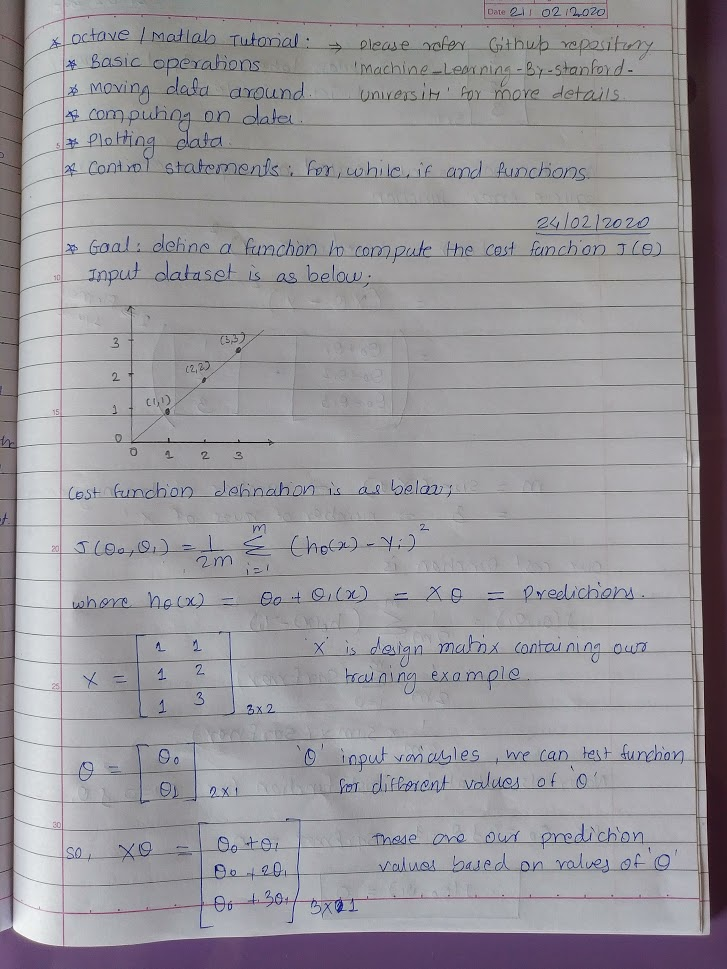
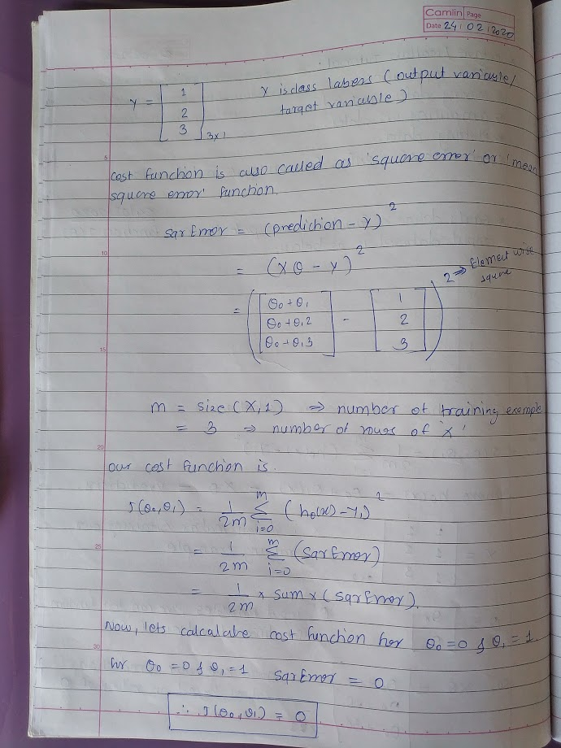
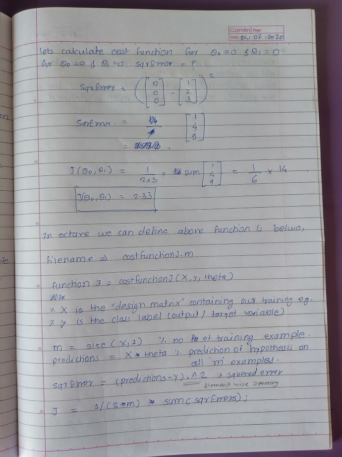

## Octave / Matlab Tutorial:
### Control Statements: for, while, if statements
1. for loop

    ```
    >> % for loop (space in below commands is only for indentation purpose)
    >> for i=1:10,
         v(i) = 2^i;
       end;
    >> v
    v =

          2      4      8     16     32     64    128    256    512   1024

    >> % we can also do this using below command
    >> indices=1:10;
    >> indices
    indices =

        1    2    3    4    5    6    7    8    9   10

    >> for i=indices,
         disp(i);
       end;
     1
     2
     3
     4
     5
     6
     7
     8
     9
     10
    >>
    ```
    
2. while loop

    ```
    >> v
    v =

          2      4      8     16     32     64    128    256    512   1024

    >> % notice to end statements in below while loop 
    >> i=1;
    >>  while true,
         v(i) = 999;
         i = i + 1;
         if i == 6,
           break;
         end;
        end;
    >> v
    v =

        999    999    999    999    999     64    128    256    512   1024

    >>
    ```
    
 3. if else

    ```
    >> % if else example
    >> v(1)
    ans =  999
    >> v(1) = 2;
    >> if v(1) == 1,
         disp('The value is one');
       elseif v(1) == 2,
         disp('the values is two');
       else
         disp('The values is not one or two');
       end;
       
       the values is two

    ```
    
4. Functions
   To define a function in Octave. Right the code in file and use the filename as function.
   e.g 'squarethisnumber.m' is file/function which will take one number as input and returns its squared value. File content (function      defination) is as below.

    ```
    function y = squareThisNumber(x)
    y = x^2;
    
    ```
    Note: Since notepad messesup with spacing, always use wordpad to open the function files.
    
    ```
    >> squareThisNumber(5)
    error: 'squareThisNumber' undefined near line 1 column 1
    >> % here we are getting above error because function is not located at Octave current path
    >> pwd
    ans = C:\Users\satish.gunjal
    >> % function is located at 'C:\Users\satish.gunjal\OneDrive\Projects\Corsera_Machine_Learning\Week_2_Octave_Tutorial\func
    tions'
    >> cd 'C:\Users\satish.gunjal\OneDrive\Projects\Corsera_Machine_Learning\Week_2_Octave_Tutorial\functions'
    >> pwd
    ans = C:\Users\satish.gunjal\OneDrive\Projects\Corsera_Machine_Learning\Week_2_Octave_Tutorial\functions
    >> squareThisNumber(5)
    ans =  25
    >> % we can also add the functions directory to Octave search path, this will than allow us to call function from any othe
    r path
    >> addpath('C:\Users\satish.gunjal\OneDrive\Projects\Corsera_Machine_Learning\Week_2_Octave_Tutorial\functions')
    >> cd 'C:\Users\satish.gunjal'
    >> pwd
    ans = C:\Users\satish.gunjal
    >> squareThisNumber(5)
    ans =  25
    >>
    
    ```
    Octave also allows us to define function which can return multiple values
    Function name is 'squareAndCubeThisNumber.m'n and function defination is as below.
    ```
    function [y1,y2] = squareAndCubeThisNumber(x)
    y1 = x^2;
    y2 = x^3;
    
    ```
    Testing the function
    
    ```
    >> [a,b] = squareAndCubeThisNumber(5);
    >> a
    a =  25
    >> b
    b =  125
    >>
    
    ```
    
 4. More sophisticated example of function
    
    
    
