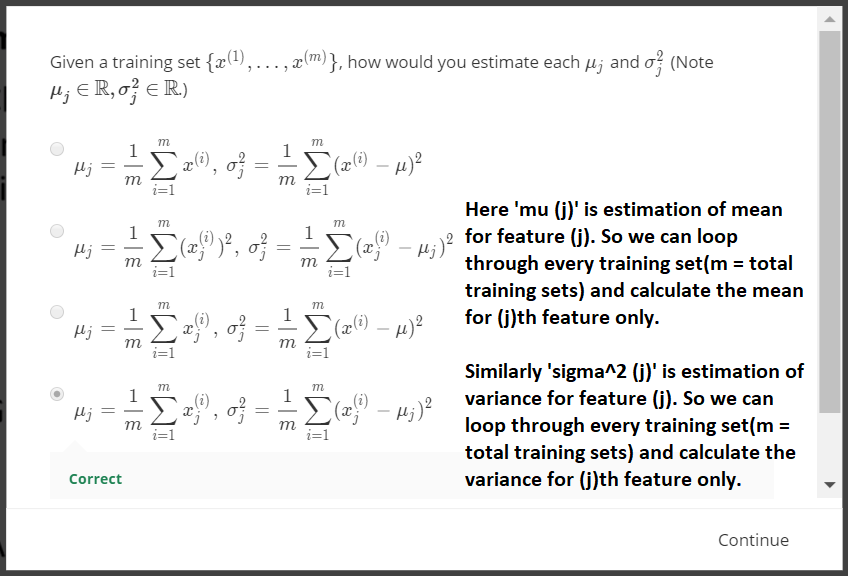

# Week 8 - Unsupervised Learning
- This week, we will be covering anomaly detection which is widely used in fraud detection (e.g. ‘has this credit card been stolen?’)
- Given a large number of data points, we may sometimes want to figure out which ones vary significantly from the average. For example, in manufacturing, we may want to detect defects or anomalies. 
- We show how a dataset can be modeled using a Gaussian distribution, and how the model can be used for anomaly detection.
- We will also be covering recommender systems, which are used by companies like Amazon, Netflix and Apple to recommend products to their users. 
- Recommender systems look at patterns of activities between different users and different products to produce these recommendations. In these lessons, we introduce recommender algorithms such as the collaborative filtering algorithm and low-rank matrix factorization.

## Density Estimation
### Problem Motivation-ivq

### Gaussian Distribution-ivq

### Algorithm-ivq

## Bulding an Anamaly Detection System
### Developing and Evaluating an Anomaly Detection System-ivq

### Anomaly Detection vs. Supervised Learning-ivq

### Choosing What Features to Use-ivq

## Multivariate Gaussian Distribution (Optional)
### Multivariate Gaussian Distribution-ivq

### Anomaly Detection using the Multivariate Gaussian Distribution-ivq

## Review
### Anomaly Detection-Graded Quiz

## Predicting Movie Ratings
### Problem Formulation-ivq

### Content Based Recommendations-ivq

## Collaborative Filtering
### Collaborative Filtering-ivq

### Collaborative Filtering-1-ivq

### Collaborative Filtering Algorithm-ivq

## Low Rank Matrix Factorization
### Vectorization- Low Rank Matrix Factorization-ivq

### Implementational Detail- Mean Normalization-ivq

## Review
### Recommender Systems-Graded Quiz

